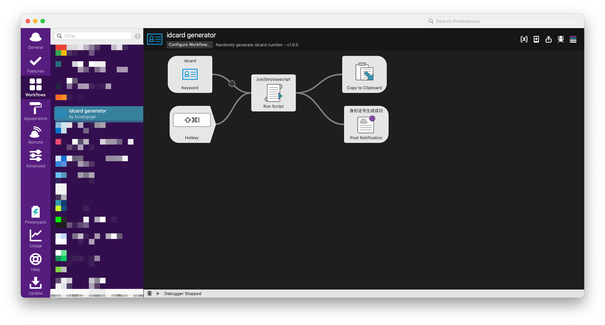

# idcard-generator-alfred-workflow
alfred的随机身份证号码生成器workflow，保证通过HuTool的IdCardUtil的校验
# 使用
- [下载](https://github.com/kuweiguge/idcard-generator-alfred-workflow/releases/download/1.0.0/idcard_generator.alfredworkflow)workflow后双击导入alfred
- 默认快捷键 `ctrl shift i`
- 默认关键字 `idcard`
- 生成后自动复制到剪贴板，直接 `ctrl + v` 粘贴即可

## 关键字

## 通知提示

## 构成
快捷键、关键字、通知内容标题，都可以自定义修改

